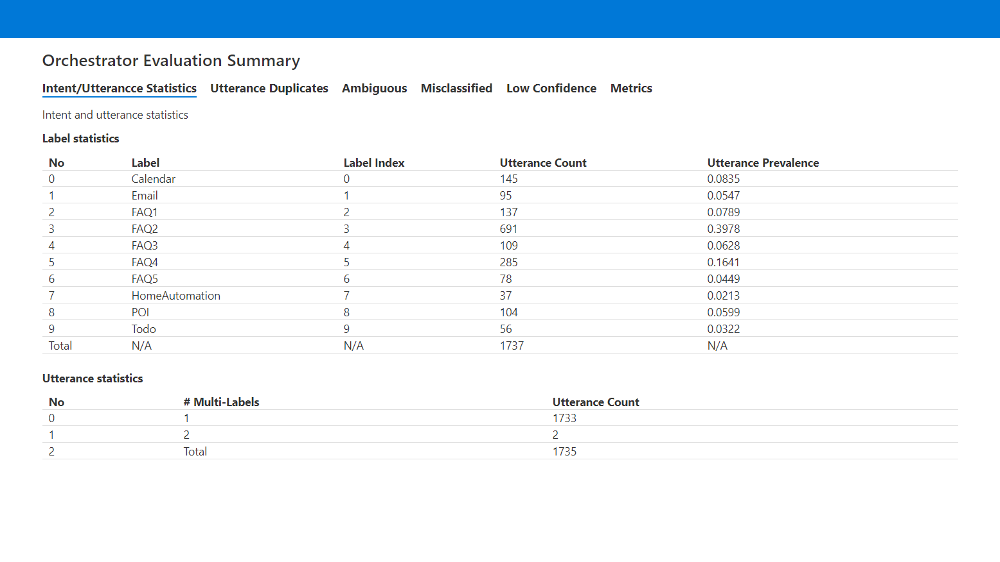
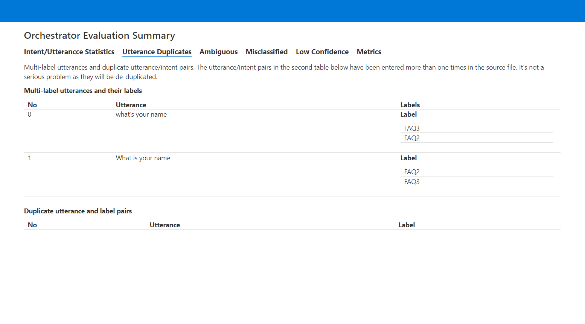
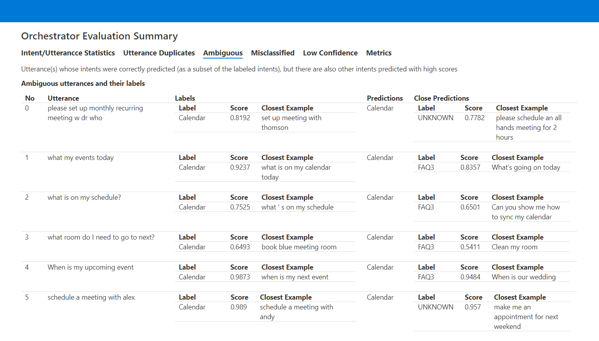
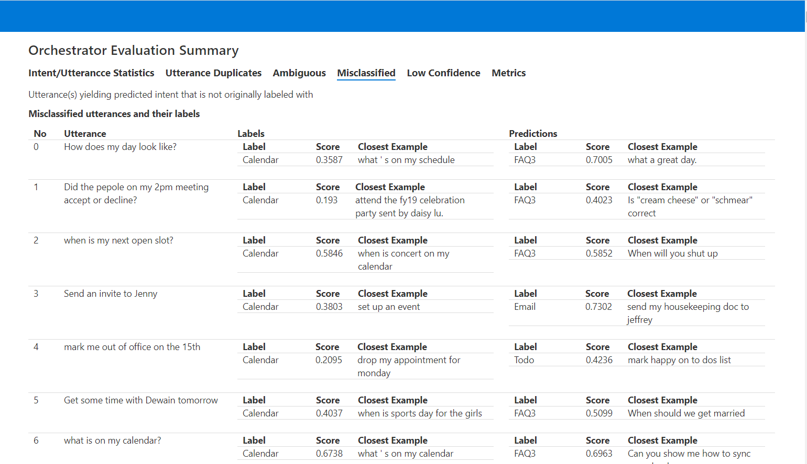
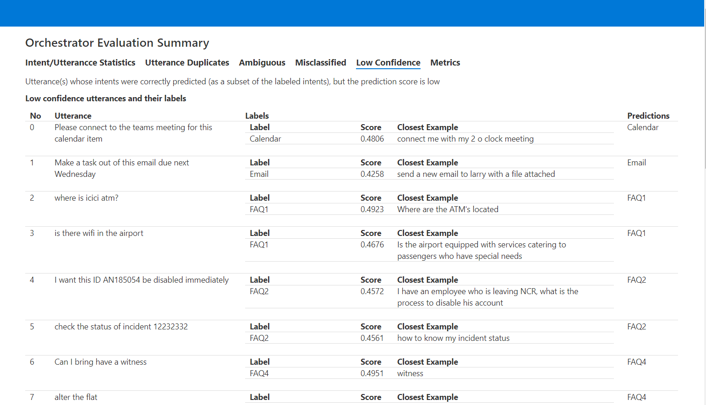
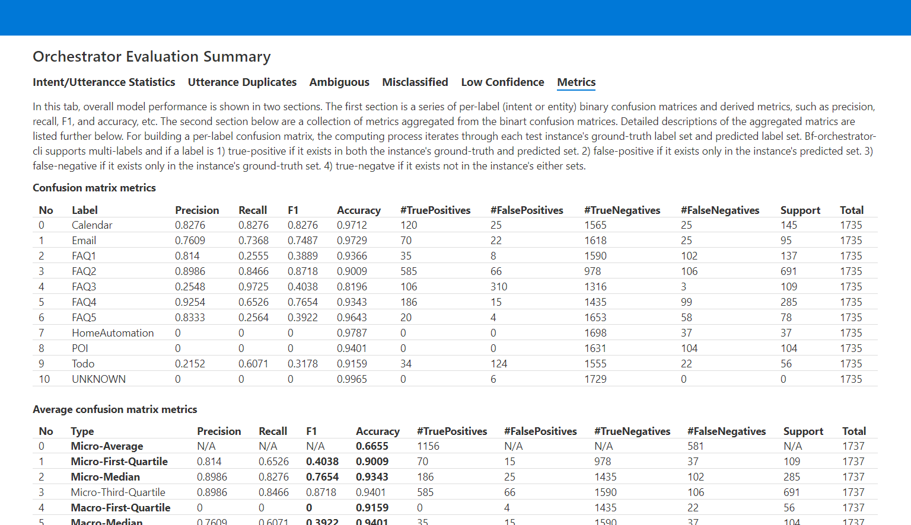

# Report Interpretation

The [BF Orchestrator CLI][1] has a "test" command for evaluating the performance of an Orchestrator snapshot file (with .blu extension). A snapshot is composed of natural language representation base model (see [models][3]) along with a set of examples provided in a label file (typically a [.lu file][4]). The snapshot file is used in Bot Framework to detect intents from user utterances. 

In order to achieve high quality natural language processing (e.g. intent detection), it is necessary to assess and refine the quality of the model. This is much simplified in Orchestrator because of its use of pre-trained models. The optimization cycle is required in order to account for human language variations. 
Learn more about Machine Learning evaluation methodology in the [References](# references) section below.

To interpret the report, use the following guidance to actions to improve the snapshot file:
- Incase utterances are the same or semantically similar, mrerge the two intent labels.
- If the utterances are not semantically similar, split an intent's utterance pool and create a new intent label.
- It the utterance are semantically close to a different intent label, change the intent label.
- Rephrase an utterance and make it semantically closer to other utterances labled with the same intent.
- Add more utterances to an intent label as the intent's utterance pool could be too scarce.
- Remove some utterances from an intent label if there were too many utterances label to it.

# Report Organization

The test command thus produces a folder with HTML report and a few supporting artifacts as follows:

- orchestrator_testing_set_ground_truth_instances.json: test instance ground-truth file in JSON format.
- orchestrator_testing_set_labels.txt: intent labels in a plain text file.
- orchestrator_testing_set_prediction_instances.json: test instance prediction file in JSON format.
- orchestrator_testing_set_scores.txt: test instance prediction file in a plain TSV format.
- orchestrator_testing_set_summary.html: report summary in HTML format

The report summary contains several sections as follows:

## Intent / Utterance Statistics

This section contains label and utterance distributions.

It has two statistical sections, one for labels, the other utterances. Attached is an example rendition of the section.

- Label statistics
- Utterance statistics

### Label statistics

Label statistics lists the number of utterances labeled to each label. Additional metrics include utterance prevalence (ratio) for every label. The distributions can give Orchestrator users an overall view of the labels and utterances, and whether the distributions are skewed and emphasize too much on some labels, but not others. A machine learn model may learn more from a label (intent) with more instances (utterances) labeled to it. Thus, a developer can check this table and see if some intents needs more utterances in the snapshot file.

### Utterance statistics

On the other hand, utterance statistics focus on the #label distribution by the utterances. Some utterances are labeled with more than one intents, which might not be desirable and could be a bug. This table reflects the distribution of multi-label utterances.
From the above screen snapshot, we can see that there are two utterances labeled twice with distinct labels. Those multi-label utterances will be listed in the next section and the owner can decide to remove the duplicates from the snapshot file.

## Utterance Duplicates

Sometimes some dataset might contain utterances tagged with the same labels multiple times.
The report also lists this redundancy.
This section has two sub-sections:

- Multi-label utterances and their labels
- Duplicate utterance and label pairs

They report on utterances with duplicate or multiple labels. A duplicate utterance is detected when it is present more than once in a snapshot file. Sometimes some dataset might even contain utterances tagged with the same labels multiple times.

The report also lists the redundancy of label/utterance pairs. Orchestrator will deduplicate such redundancy.
Please see the attached screen snapshot as an example.

## Ambiguous

This section reports on utterances with ambiguous predictions. For an evaluation utterance, if an Orchestrator model correctly predicts its intent label, then it's a true positive instance. Every intent label will be predicted with a score, which is essentially the probability or confidence for that label prediction. The predicted intent usually is the one with the highest score. If the Orchestrator model also makes some other high-score prediction close to that of the correctly predicted label, then we call such a prediction "ambiguous."

In this section, the report lists all the utterances with an ambiguous prediction in a table.
The table has several columns:

- Utterance         -- the utterance
- Labels            -- the true labels for the utterance
- Predictions       -- the labels predicted by the Orchestrator model
- Close Predictions -- some other labels predicted with a close, high score to that of the predicted label. 

Besides the prediction score, the report also shows the closest example to the utterance
within the label's utterance set.
Below is a screen snapshot of an ambiguous report:

Ambiguous utterances can be a sign of overlapping intent labels. In another word, two intent labels may have their utterance pools semantically close to each other. In the example report about, the utterance "what my events today" was correctly predicted with the Calendar intent label and the closest example is
"What is on my calendar today". However the FAQ3 intent was also predicted with a high school and the closest example from that intent is "What's going on today." From these two closest example, one can remove the latter from the FAQ3 intent as it is now more specific to the Calendar intent, then just a FAQ example.

## Misclassified

This section reports on utterances with incorrect predictions. A misclassified predication is one where an Orchestrator model falsely predicts its intent label. Usually the label with the highest prediction score is chosen as the predicted label, but it can be different from the ground-truth label for the utterance.

Similar to the last section, the report also lists the prediction and ground-truth labels with
their prediction scores and closest examples. Below is a screen snapshot of the misclassified report. A user can also follow the utterances list and decide to update their intent labels and or rephrase the utterances themselves.

## Low Confidence

This section reports on predictions that scored too low to be considered "confident" intent detection.

Sometimes a prediction may be predicted correctly with the highest scores among all labels, but the score is very low, lower than a threshold. We call such predictions low confidence.
Notice that there are several default thresholds used to guide producing the report sections thus far. Usually an Orchestrator user can just predict a label with the highest score, but he/she can also utilize some thresholds for a fine-tuned prediction in a chat bot's dialog logic.

Just like the last sections, the report lists the prediction and ground-truth labels with their prediction scores and closest examples. Also like the previous sections, the utterances listed in this section can guide a user how to improve the snapshot file.

## Metrics

The Metrics section is an advanced report that contains analytics that is common in Machine Learning evaluation methodologies.

Advanced machine-learning practitioners may analyze the overall model performance expressed in machine learning metrics. In this section, the report calculates some common metrics in two sections:

- Confusion matrix metrics
- Average confusion matrix metrics

### Confusion matrix metrics

In this table, the Orchestrator CLI test command reads an evaluation set with ground-truth labels. An evaluation set contains a collection of utterances and their labels. It then calls the Orchestrator base model and makes a prediction for every utterance in the set and generate predicted labels for every utterance. It then compares the predicted labels against the ground-truth labels and creates a table of per-label binary confusion matrices.

For a binary confusion matrix, there are four cells:
    - #True Positives (TP)
        - #False Positives (FP)
        - #False Neagatives (FN)
        - #True Negatives (TN)

For a label, if it exists in an utterance's ground-truth label set as well as in the predicted label set,
then that utterance is a TP for the label.
If the label only exists in the utterance's predicted label set, then it's a false positive.
If the label only exists in the utterance's ground-truth set, then it's a false negative.
If the label does not exist in either the ground-truth or predicted set, then it's a true negative.

By the way, for entity extraction, as a label contains an entity name, entity offset in an utterance and its length,
there can be numerous true negatives, since there are limitless combinations of the entity attributes
not in the ground-truth or the predicted sets.
Thus, for intent prediction evaluation, all four cells are used to calculate confusion matrix metrics,
but only the first three are used for entity-extraction evaluation.

Using just the first three cells of a binary confusion matrix,
the Orchestrator "test" command can then calculate some
more sophisticated metrics, including

    - Precision     - TP / (TP + FP)
    - Recall        - TP / (TP + FN)
    - F1            - harmonic mean of precision and recall

These three metrics do not use TN, but the simple accuracy metric need all 4 cells, including TN.

For details of many confusion matrix metrics, please reference [Wikipedia: Confusion matrix][2].

### Average confusion matrix metrics

Since Orchestrator can evaluate multiple labels, one confusion matrix for each, there can be many
metrics for detailed analysis. For reporting and KPI purpose, it would be great to aggregate all
these metrics for an overall metric and model performance.

There are many nuanced ways to aggregate confusion matrix metrics. For comparing models, it's critical
to compare based on a consistent formula. Please reference the [BF Orchestrator CLI][1] readme page for advanced CLI usage details.

## Thresholds

This evaluation report is created using several thresholds that they can also be useful in building chat bot logic. These thresholds can be reset through environment variables listed below:

- ambiguousClosenessThreshold: default to 0.2, which means that if there are labels predicted to have a score close to within 20% of the top and corrected predicted label, then this utterance is ambiguously predicted.
- lowConfidenceScoreThreshold: default to 0.5, which means that if the top predicted score is lower than 0.5, then the prediction is considered low confidence.
- multiLabelPredictionThreshold: default to 1, which means that the report will predict only one label. However, if the threshold is lower than 1, then every label with a predicted score higher than that will be predicted. This threshold is usually used for multi-label, multi-intent scenarios.
- unknownLabelPredictionThreshold:default to 0.3, which means that the evaluation process will consider a prediction UNKNOWN if the score is lower than that threshold.

## References

- [BF Orchestrator CLI](https://aka.ms/bforchestratorcli)
- [Wikipedia: Confusion matrix](https://en.wikipedia.org/wiki/Confusion_matrix)
- [Wikipedia: Training, validation, and test sets](https://en.wikipedia.org/wiki/Training,_validation,_and_test_sets)
- [Machine Learning Mastery](https://machinelearningmastery.com/difference-test-validation-datasets/).

[1]:https://aka.ms/bforchestratorcli	"BF Orchestrator CLI"
[2]:https://en.wikipedia.org/wiki/Confusion_matrix	"Wikipedia: Confusion matrix"
[3]:https://aka.ms/nlrmodels	"NLR Models"
[4]:https://docs.microsoft.com/en-us/azure/bot-service/file-format/bot-builder-lu-file-format?view=azure-bot-service-4.0 ".LU format"
[5]: https://github.com/microsoft/botframework-cli/tree/main/packages/orchestrator#bf-orchestratortest "bf orchestrator:test"
