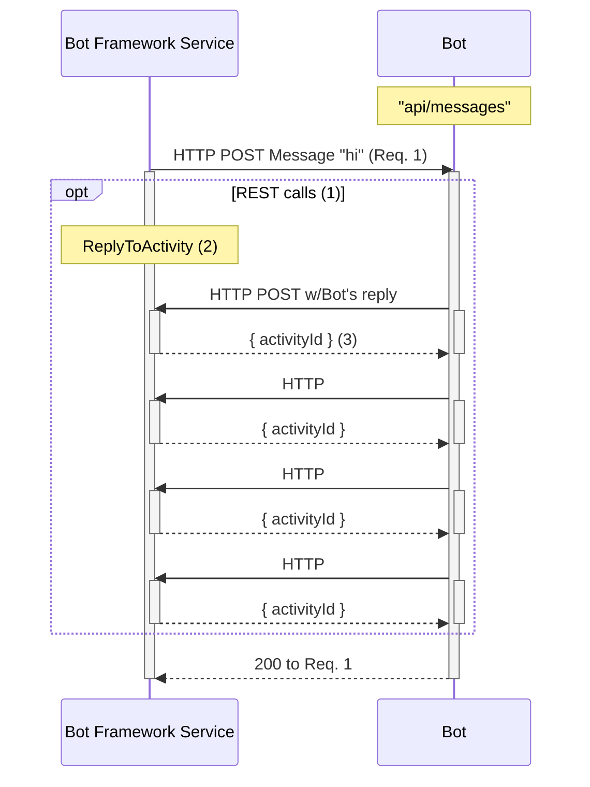

```mermaid

    sequenceDiagram
    
    participant BFS as Bot Framework Service
    participant Bot

    Note over Bot: "api/messages"
    BFS ->> Bot: HTTP POST Message "hi" (Req. 1)
    activate BFS
    activate Bot
        opt REST calls (1)
            Note over BFS: ReplyToActivity (2)
            Bot ->> BFS: HTTP POST w/Bot's reply
            activate Bot
            activate BFS
                BFS -->> Bot: { activityId } (3)
            deactivate BFS
            deactivate Bot

            Bot ->> BFS: HTTP 
            activate Bot
            activate BFS
                BFS -->> Bot: { activityId }
            deactivate BFS
            deactivate Bot

            Bot ->> BFS: HTTP 
            activate Bot
            activate BFS
                BFS -->> Bot: { activityId }
            deactivate BFS
            deactivate Bot

            Bot ->> BFS: HTTP 
            activate Bot
            activate BFS
                BFS -->> Bot: { activityId }
            deactivate BFS
            deactivate Bot
            end

        Bot -->> BFS: 200 to Req. 1
    deactivate Bot
    deactivate BFS
```