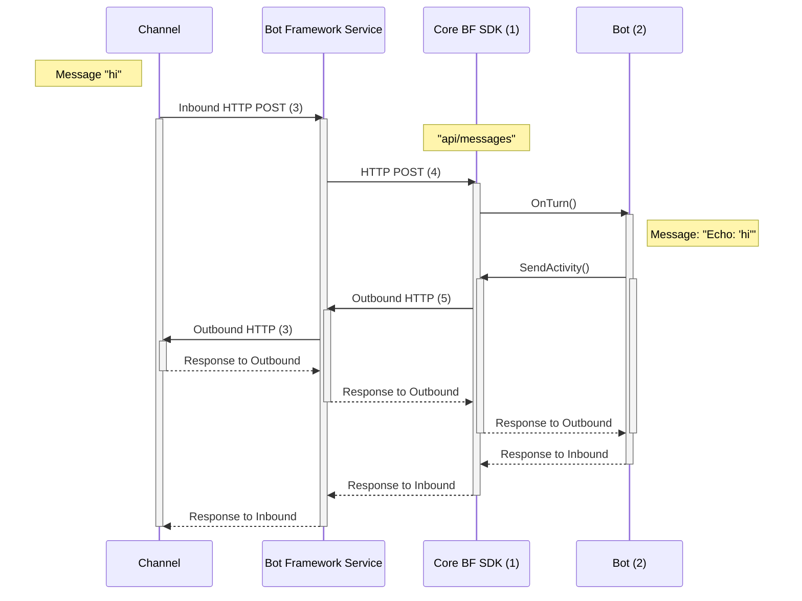

```mermaid

sequenceDiagram

    participant Channel
    participant BFS as Bot Framework Service
    participant CoreSDK as Core BF SDK (1)
    participant Bot as Bot (2)

    Note left of Channel: Message "hi"
    Channel ->> BFS: Inbound HTTP POST (3)
    activate Channel
    activate BFS
        Note over CoreSDK: "api/messages"
        BFS ->> CoreSDK: HTTP POST (4)
        activate CoreSDK
            CoreSDK ->> Bot: OnTurn()
            activate Bot
            
            Note right of Bot: Message: "Echo: 'hi'"
            Bot ->> CoreSDK: SendActivity()
            activate Bot
            activate CoreSDK
        CoreSDK ->> BFS: Outbound HTTP (5)
        activate BFS
    BFS ->> Channel: Outbound HTTP (3)
    activate Channel
    
    Channel -->> BFS: Response to Outbound
    deactivate Channel
        BFS -->> CoreSDK: Response to Outbound
        deactivate BFS
            CoreSDK -->> Bot: Response to Outbound
            deactivate CoreSDK
            deactivate Bot
            Bot -->> CoreSDK: Response to Inbound
            deactivate Bot
        CoreSDK -->> BFS: Response to Inbound
        deactivate CoreSDK
    BFS -->> Channel: Response to Inbound
    deactivate BFS
    deactivate Channel
```