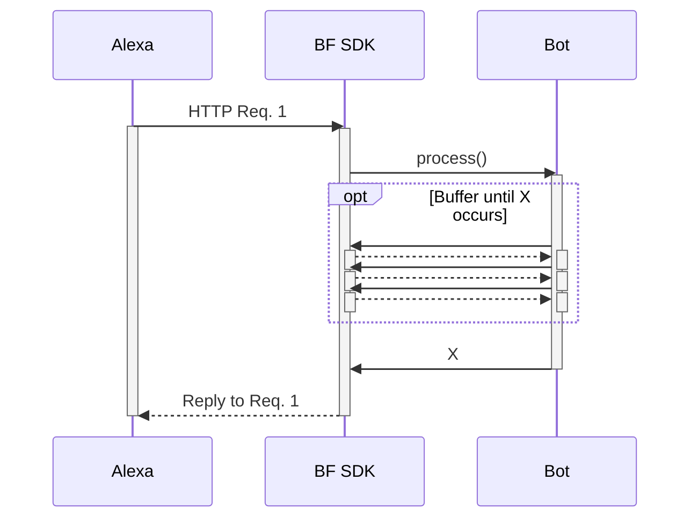

```mermaid
    sequenceDiagram

    participant Alexa
    participant SDK as BF SDK
    participant Bot

    Alexa ->> SDK: HTTP Req. 1
    activate Alexa
    activate SDK
        SDK ->> Bot: process()
        activate Bot

            opt Buffer until X occurs
            Bot ->> SDK: 
            activate Bot
            activate SDK
                SDK -->> Bot: 
            deactivate SDK
            deactivate Bot
           
            Bot ->> SDK: 
            activate Bot
            activate SDK
                SDK -->> Bot: 
            deactivate SDK
            deactivate Bot
            
            Bot ->> SDK: 
            activate Bot
            activate SDK
                SDK -->> Bot: 
            deactivate SDK
            deactivate Bot
            end

        Bot ->> SDK: X
        deactivate Bot
    
    SDK -->> Alexa: Reply to Req. 1
    deactivate SDK
    deactivate Alexa
```