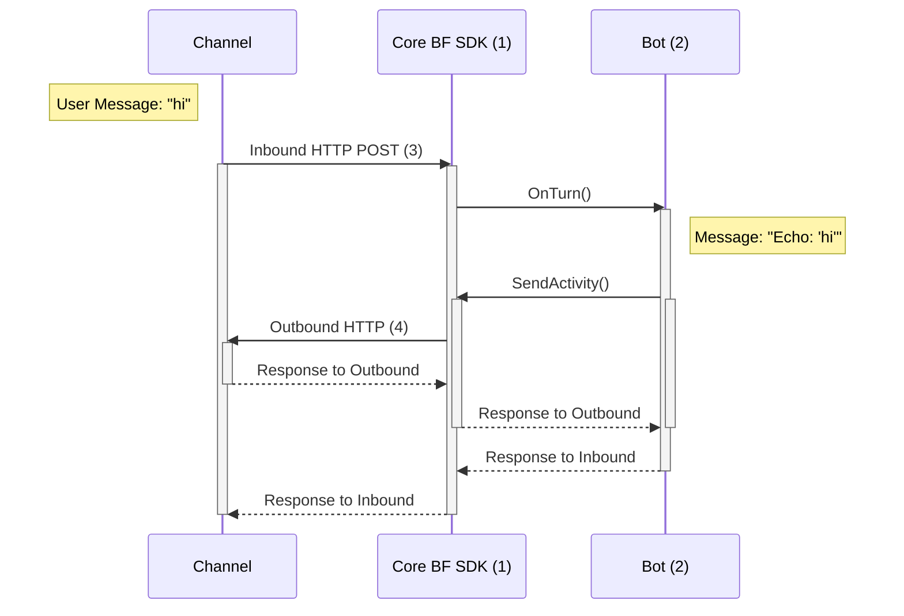

```mermaid

sequenceDiagram

    participant Channel
    participant CoreSDK as Core BF SDK (1)
    participant Bot as Bot (2)

    Note left of Channel: User Message: "hi"
        Channel ->> CoreSDK: Inbound HTTP POST (3)
        activate Channel
        activate CoreSDK
            CoreSDK ->> Bot: OnTurn()
            activate Bot
                Note right of Bot: Message: "Echo: 'hi'"
            Bot ->> CoreSDK: SendActivity()
            activate Bot
            activate CoreSDK
        CoreSDK ->> Channel: Outbound HTTP (4)
        activate Channel
            
        Channel -->> CoreSDK: Response to Outbound
        deactivate Channel
            CoreSDK -->> Bot: Response to Outbound
            deactivate CoreSDK
            deactivate Bot

            Bot -->> CoreSDK: Response to Inbound
            deactivate Bot
        CoreSDK -->> Channel: Response to Inbound
        deactivate CoreSDK
        deactivate Channel
```