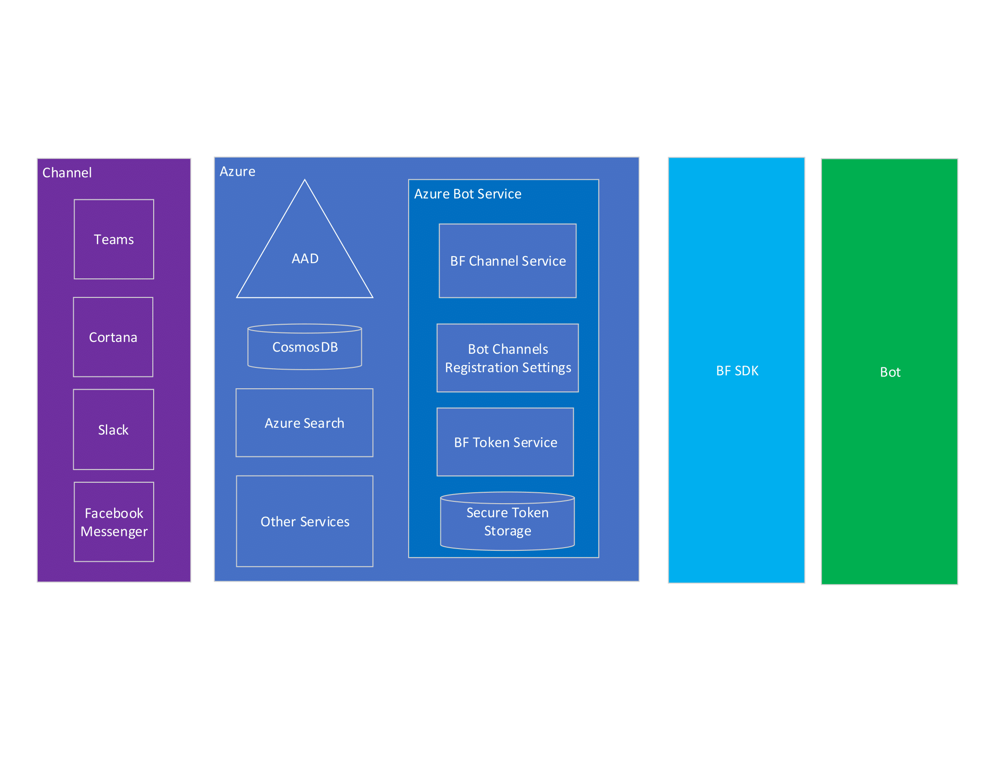

# Activity Flow in the Bot Framework

This section contains diagrams that illustrate the participants involved when Activities flows between Channel and Bot.

- [HTTP Protocol](#http-protocol)
- [Detailed Look into the SDK](#detailed-look-into-the-sdk)
- [Activity Flow Participants](#activity-flow-participants)

# *HTTP Protocol*
- [`BotFrameworkAdapter` vs. Custom Adapter](#botframeworkadapter-vs-custom-adapter)
- [Details of communication between Bot Framework Service and Bot](#details-of-communication-between-Bot-Framework-Service-and-Bot)
- [Additional Information on Custom Adapters' Protocol]()

# `BotFrameworkAdapter` vs. Custom Adapter

The following two diagrams illustrate the differences in how an Activity flows from Channel to Bot when using the standard **`BotFrameworkAdapter`** versus using a **customer adapter**.

-  [Communication between a Channel and Bot using the *`BotFrameworkAdapter`*](#communication-between-a-channel-and-bot-using-the-botframeworkadapter)
-  [Communication between a Channel and Bot using a *customer adapter*](#communication-between-a-channel-and-bot-with-a-customer-adapter)

## **Communication between a Channel and Bot using the *`BotFrameworkAdapter`***
The canonical Bot Framework protocol includes communication between the **Channel** (Teams, Cortana, Direct Line Speech, Slack etc.), **Bot Framework Service**, **`BotFrameworkAdapter`**, and the **Bot**.

The **Bot Framework Service** lives in the cloud and takes on the role of translating the data from multiple Channels into the Bot Framework protocol in a form that your local Bot code can understand (and vice versa going from Bot to Channels). This allows your Bot to communicate with multiple Channels, without having to understand which Channel the data is coming from. You don't need to write several permutations of your Bot specific to *each* Channel, if the Channel is supported in the Service.

The `BotFrameworkAdapter` passes the Channels' information off in the form of Activities for your Bot to consume.

1. Default adapter used in the SDK is the `BotFrameworkAdapter`.
2. Bot derives from the `ActivityHandler` class from the SDK, which implements `IBot`.
3. Protocol between Channel & Bot Framework Service:
    * Exact communication details between Channel and Bot Framework Service varies per channel.
    * For example, here could be HTTP POST requests, which we illustrate in the diagram, or they could be another kind of REST call.
4. We *know for certainty* this is an HTTP POST request. 
5. Bot Framework REST API call.
    * The `BotFrameworkAdapter` creates a `ConnectorClient` that allows the Bot to send Activities to users on Channels configured in ABS.
    * The `ConnectorClient` speaks with the BF Service, which exposes different endpoints that your bot can call via HTTP request. 
    * Example APIs:
        * Replying to an Activity will POST to `"v3/conversations/{conversationId}/activities/{activityId}"`
        * Sending to end of conversation will POST to `"/v3/directline/conversations/{conversationId}/activities"`
        * See [Bot Framework REST API reference](https://docs.microsoft.com/en-us/azure/bot-service/rest-api/bot-framework-rest-connector-api-reference?view=azure-bot-service-4.0) for more details.

## **Communication between a channel and bot with a *customer adapter***
The Bot Framework SDK includes more recent work on custom adapters as well, such as for Slack, Facebook, Twilio, etc. 
* The communication between a Channel and a customer adapter is direct, **without the Bot Framework Service cloud layer in between**. 
* The customer adapter itself does the same work as what the Bot Framework Service does, in that it translates the Channel's inbound data to the Bot into a shape that the Bot can consume, and also shapes calls outbound from your Bot to the Channel in a way that the Channel can understand, but with the added bonus of less latency.
* Additionally, custom adapters may also allow you to have access to more of the 3rd party's native APIs, as the Bot Framework Service might possibly not be as up-to-date in all the latest endpoints the 3rd parties expose.
* The tradeoffs of using a custom adapter as opposed to the `BotFrameworkAdapter` are:
    * The one custom adapter only speaks to one Channel (e.g. Slack Adapter can speak to Slack, but not Facebook)
    * You may have to do more of the heavy lifting. For example, if your bot sends a "hero card", the `BotFrameworkAdapter` knows how to translate that hero card into a "Teams hero card" that the Teams Channel can consume, but if you use a custom adapter, you may have to do the work of transforming the Bot's "hero card" to "Facebook hero card".

1. Core SDK includes custom adapters (e.g. Slack Adapter, Facebook Adapter, Twilio Adapter, etc.)
2. Bot derives from `ActivityHandler`, which implements `IBot`
3. Protocol between Channel & BF SDK:
    * Exact communication details between Channel and custom adapters in the BF SDK varies per channel.
    * For example, it could be an HTTP POST request to "api/facebook".
4. REST HTTP calls directly to the 3rd party service's APIs
    * It *does not* call the Bot Framework Service layer

## Details of communication between Bot Framework Service and Bot
The following illustrates a few more details on the communication between the Bot Framework Service and the Bot using the `BotFrameworkAdapter`.

1. Calls from Bot to the Bot Framework Service are industry-standard REST API calls with JSON over HTTPS.
2. Example showing Bot calling the Bot Framework Service's `ReplyToActivity` endpoint (`POST v3/conversations/{conversationId}/activities/{activityId}`)
    * Bot can have 1 call in reply to Req. 1 (for example just Sending "Echo: 'hi'" message back) or the bot can have multiple REST calls in response to the Bot Framework Service's Req. 1, as illustrated with the subsequent HTTP calls from the Bot in this diagram.
3. A `ResourceResponse` that contains an id property which specifies the ID of the Activity that was sent to the Bot.

## Custom Adapters Protocol, Continued

Certain Channels communicate with custom adapters, such as Alexa and Slack. It is the custom adapter's job to transform the data received from the Bot into the right shape or enforce the expected protocol flow of the Channel that custom adapter is communitcating with.

For some channels, like Slack, the Channel follows the "Russian nesting doll" shape in it's request-response protocol, as illustrated in the [sequence diagram of Activity Flow using the BF Service and BotFrameworkAdapter](#communication-between-a-channel-and-bot-using-the-botframeworkadapter).

Many channels, however, such as for Alexa, Google, etc., actually follow a different protocol pattern, where the HTTP request is followed by by the HTTP response, with the bot's reply within that HTTP response (i.e. not a separate Bot request that has the Bot's reply, followed by the status code response). To satisfy this common request-reply pattern, some custom adapters will buffer between the customer adapter and Bot, until the entirety of the reply to the the Channel's original request is ready. See diagram below for clarification.

Above Alexa channel makes a request to the bot, hitting the custom adapter layer between. The custom adapter and bot buffer the response to the Alexa reuqest until X occurs, when the Bot's reply is ready to be sent with in the HTTP response.

___

# *Detailed look into the SDK*

### *Modeled after the C# EchoBot example code in ['How bots work'](https://docs.microsoft.com/en-us/azure/bot-service/bot-builder-basics?view=azure-bot-service-4.0&tabs=csharp#bot-logic) documentation.*

This diagram models the flow of an Activity going from Channel to Bot, then back out from Bot to Channel in response, with a high focus on the pieces of the Bot Framework SDK that are involved.

1. Bots are essentially websites that are hosted in a Web App exposed over HTTP.
    - For example, your bot receives POST requests to its `"api/messages"` endpoint.

2. Calls from Bot to the Bot Framework Service are industry-standard REST API calls with JSON over HTTPS. See [Communication between a Channel and a Bot using the BotFrameworkAdapter](https://github.com/Zerryth/Mermaid/tree/master/MarkdownFiles/ActivityFlow#communication-between-a-channel-and-a-bot-thats-using-botframeworkadapter) and [Communication between Bot Framework Service and Bot](https://github.com/Zerryth/Mermaid/tree/master/MarkdownFiles/ActivityFlow#details-of-communication-between-bot-framework-service-and-bot) for more details.
    - For example, to Reply to Activity the Bot's Connector will `POST v3/conversations/{conversationId}/activities/{activityId}`.

___

# *Activity Flow Participants*
Block diagram of the participants involved in a general Activity flow.

