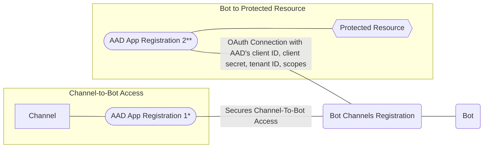

```mermaid
    graph LR
    
    subgraph Channel-to-Bot Access
        Channel --- AAD1([AAD App Registration 1*])
    end
    AAD1 -- Secures Channel-To-Bot Access --- BotChannelsRegistration(Bot Channels Registration)

    subgraph Bot to Protected Resource
        AAD2([AAD App Registration 2**]) --- ProtectedResource{{Protected Resource}}
    end
    AAD2 -- OAuth Connection with AAD's client ID, client secret, tenant ID, scopes --- BotChannelsRegistration

    BotChannelsRegistration --- Bot(Bot)

```