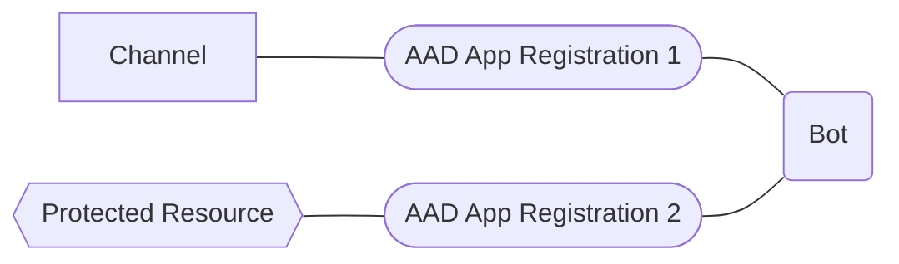

```mermaid
    graph LR
        Channel --- AAD1([AAD App Registration 1])
        AAD1  --- Bot(Bot)
        
        ProtectedResource{{Protected Resource}} --- AAD2([AAD App Registration 2])
        AAD2  --- Bot
```