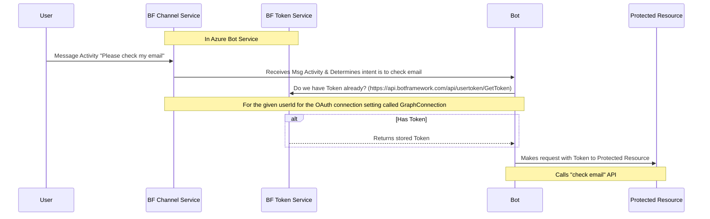

```mermaid
sequenceDiagram

participant User
participant BFCS as BF Channel Service
participant BFTS as BF Token Service
Note over BFCS, BFTS: In Azure Bot Service
participant Bot
participant ProtectedResource as Protected Resource


User ->> BFCS: Message Activity "Please check my email"
BFCS ->> Bot: Receives Msg Activity & Determines intent is to check email
Bot ->> BFTS: Do we have Token already? (https://api.botframework.com/api/usertoken/GetToken)
Note over BFCS, Bot: For the given userId for the OAuth connection setting called GraphConnection
alt Has Token
    BFTS -->> Bot: Returns stored Token
end

Bot ->> ProtectedResource: Makes request with Token to Protected Resource
Note over Bot, ProtectedResource: Calls "check email" API

```