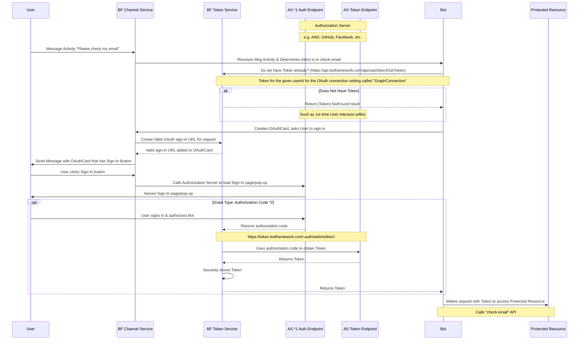

### Bot does not have token yet, OAuth flow

1. Authorization Server (AS).
    * The AS can be within Azure, such as using AAD as our token provider, or outside of Azure as well, like in the case of using GitHub as the AS.
2. There are many different authorization grants, or OAuth flows, that detail how exactly how to use the identity of the owner of the protected resource in exchange for an access token (e.g. authorization code, client credentials, device code, refresh token, implicit, etc.)