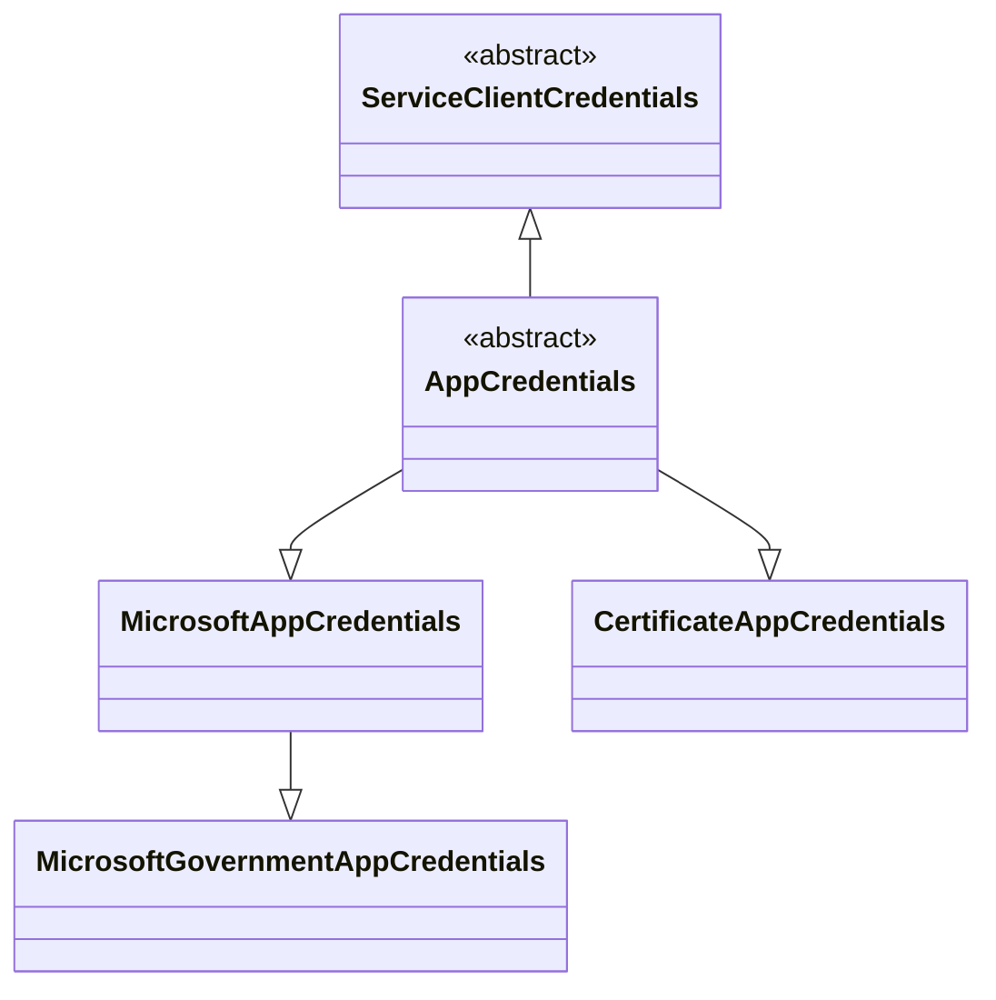

#### `AppCredentials` Class Diagram

```mermaid
    classDiagram
        class ServiceClientCredentials {
        }
        <<abstract>> ServiceClientCredentials

        class AppCredentials {
        }
        <<abstract>> AppCredentials
    
        ServiceClientCredentials <|-- AppCredentials

        AppCredentials --|> MicrosoftAppCredentials
        MicrosoftAppCredentials --|> MicrosoftGovernmentAppCredentials
        AppCredentials --|> CertificateAppCredentials
```
* `ServiceClientCredentials` is an [MS REST class](https://docs.microsoft.com/en-us/dotnet/api/microsoft.rest.serviceclientcredentials?view=azure-dotnet).