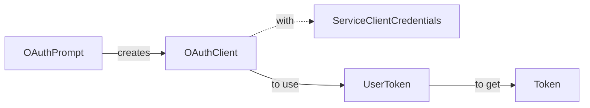

#### Use `AppCredentials` to create an `OAuthClient`
- The `OAuthPrompt`'s `ICredentialTokenProvider` creates an `OAuthClient` to send a request to get a token.
- You must use `ServiceClientCredentials` in order to initialize an `OAuthClient` instance.

