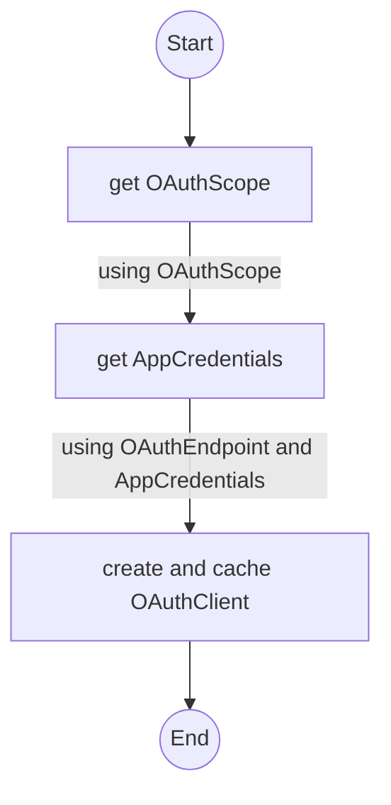
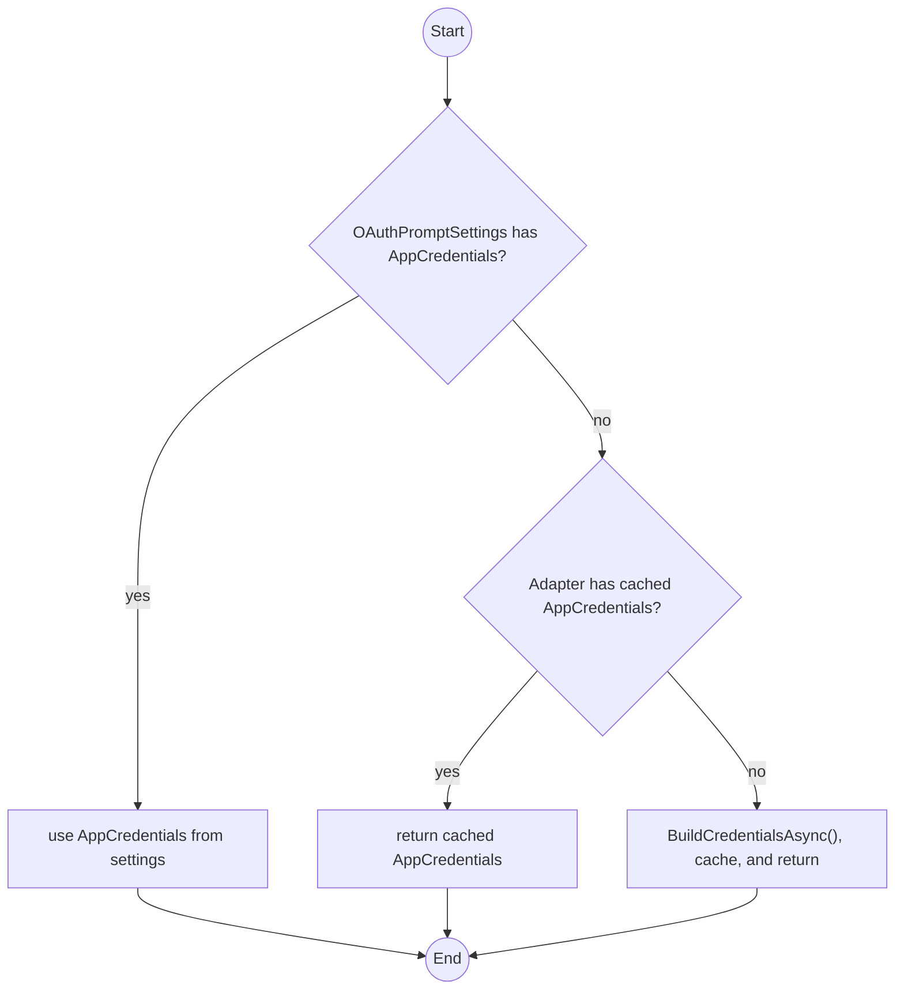

#### Creating `OAuthClient` Flow Chart

```mermaid
    graph TD
        Start((Start)) --> OAuthScope[get OAuthScope] -- using OAuthScope --> AppCredentials[get AppCredentials] --  using OAuthEndpoint and AppCredentials--> OAuthClient[create and cache OAuthClient] --> End((End))
```

#### Expanding on 2nd Step - Getting AppCredentials

``` mermaid
    graph TD
        Start((Start)) --> hasAppCredentialsInSettings{OAuthPromptSettings has AppCredentials?}
        hasAppCredentialsInSettings -- yes --> credsFromSetting[use AppCredentials from settings]
        hasAppCredentialsInSettings -- no --> cachedCreds{Adapter has cached AppCredentials?}

        cachedCreds -- yes --> returnCachedCreds[return cached AppCredentials]
        cachedCreds -- no --> buildCredentials["BuildCredentialsAsync(), cache, and return "]

        credsFromSetting --> End((End))
        returnCachedCreds --> End
        buildCredentials --> End
```