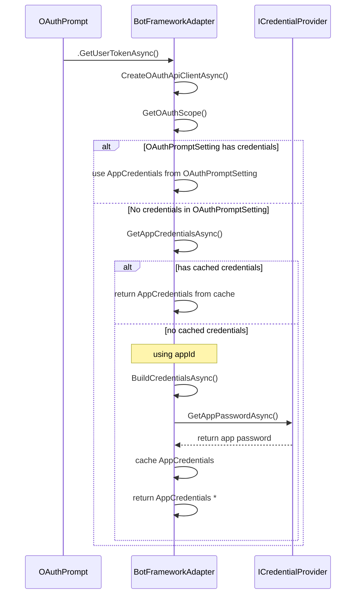

-  `BuildCredentialsAsync()` returns either `MicrosoftAppCredentials` or `MicrosoftGovernmentAppCredentials` type of `AppCredentials`
    - override this method if you want to derive a different type of `AppCredentials`, such as `CertificateAppCredentials`.