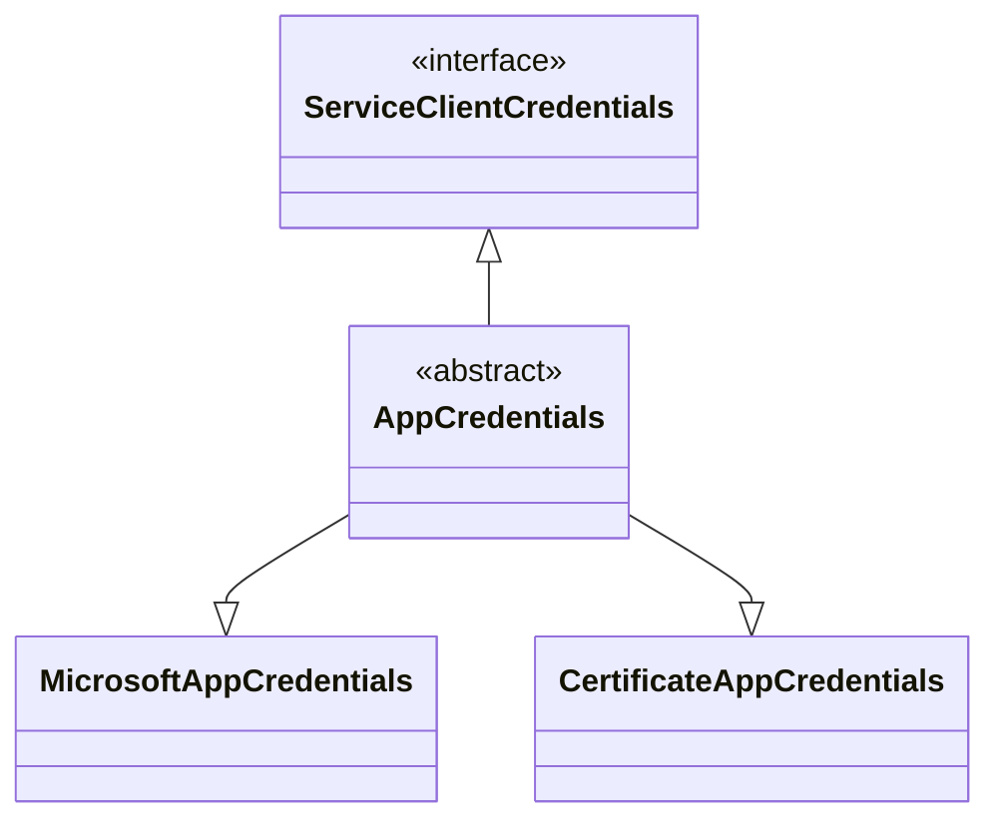

#### `AppCredentials` Class Diagram

```mermaid
    classDiagram
        class ServiceClientCredentials {
        }
        <<interface>> ServiceClientCredentials

        class AppCredentials {
        }
        <<abstract>> AppCredentials
    
        ServiceClientCredentials <|-- AppCredentials

        AppCredentials --|> MicrosoftAppCredentials
        AppCredentials --|> CertificateAppCredentials
```
* `ServiceClientCredentials` is an [ms-rest interface](https://github.com/Azure/ms-rest-js/blob/master/lib/credentials/serviceClientCredentials.ts).