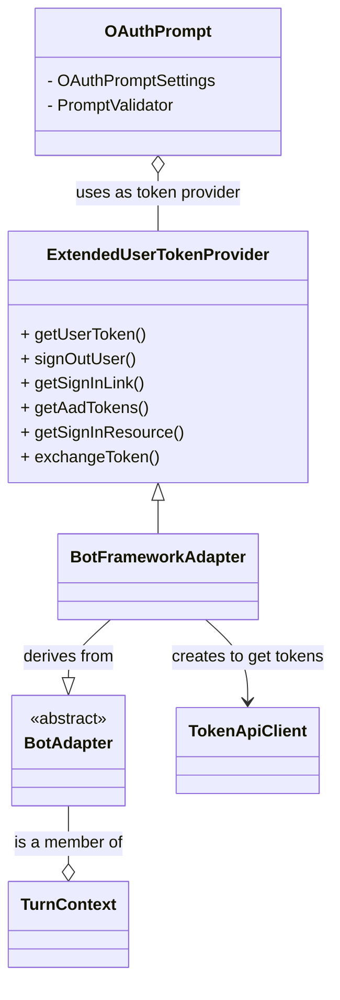

`OAuthPrompt` uses a `BotFrameworkAdapter` that implements `ExtendedUserTokenProvider` to acquire tokens.

```mermaid
    classDiagram
        class OAuthPrompt {
            - OAuthPromptSettings
            - PromptValidator
        }

        class BotAdapter {
        }
        <<abstract>> BotAdapter

        class ExtendedUserTokenProvider {
            + getUserToken()
            + signOutUser()
            + getSignInLink()
            + getAadTokens()
            + getSignInResource()
            + exchangeToken()
        }

        OAuthPrompt o-- ExtendedUserTokenProvider: uses as token provider
        ExtendedUserTokenProvider <|-- BotFrameworkAdapter
        BotFrameworkAdapter --> TokenApiClient : creates to get tokens
        BotFrameworkAdapter --|> BotAdapter: derives from
        BotAdapter --o TurnContext: is a member of
```