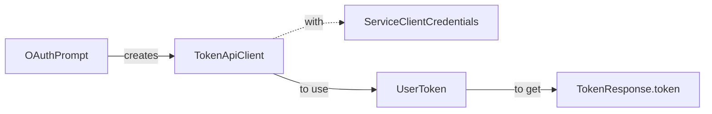

#### Use `AppCredentials` to create a `TokenApiClient`
- The `OAuthPrompt`'s `ExtendedUserTokenProvider` creates a `TokenApiClient` to send a request to get a token.
- You must use `ServiceClientCredentials` in order to initialize an `TokenApiClient` instance.

