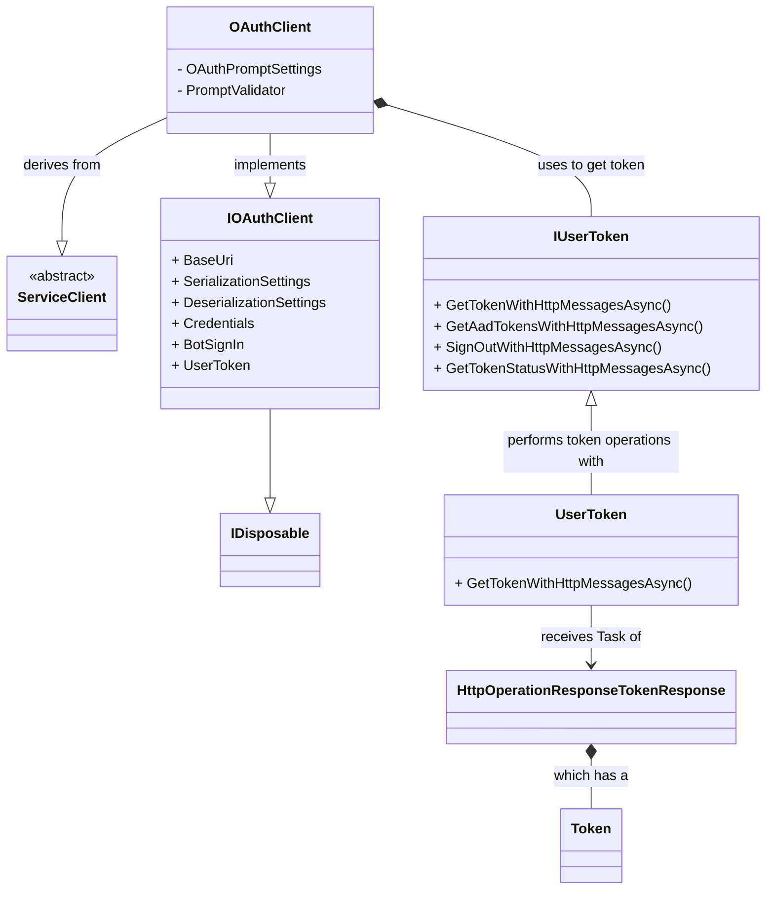

#### `OAuthClient` Class Diagram

* `HttpOperationResponseTokenResponse` should be `HttpOperationResponse<TokenResponse>` (diagram tool breaks on special chars in class diagram).
* `ServiceClient` is an [MS REST class](https://docs.microsoft.com/en-us/dotnet/api/microsoft.rest.serviceclient-1?view=azure-dotnet).