Class diagrams and flow charts exlaining the structure of `OAuthPrompt` authentication and authorization in the Bot Framework.

### **Adapter and `TurnContext`**

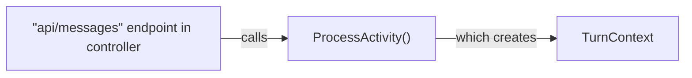

On `TurnContext` Initialization
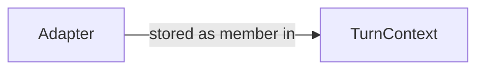

`OAuthPrompt` has various methods* that uses `BotAdapter` within its logic:
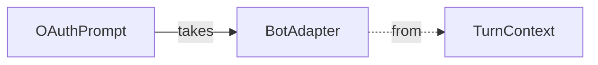
* `OAuthPrompt` methods that use `BotAdapter`: `BeginDialogAsync()`, `GetUserTokenAsync()`, `SignUserOutAsync()`, `SendOAuthCardAsync()`, `RecognizeTokenAsync()`

### **Class Diagrams of `OAuthPrompt` and How It Acquires Tokens**
- [C#](#c-token-provider-in-oauthprompt)
- [JS](#js-token-provider-in-oauthprompt)

Note:
- The class diagrams obscures some of the class properties in order to better highlight the portions related specifically to authentication and authorization.
- Class diagrams are read from top to bottom (regarding what class the link notes pertain to)

#### **C#: Token Provider in `OAuthPrompt`:**

`OAuthPrompt` uses a `BotFrameworkAdapter` that implements `ICredentialTokenProvider` to acquire tokens.

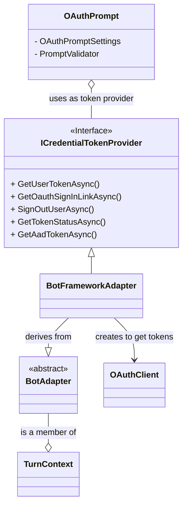

#### Use `AppCredentials` to create an `OAuthClient`
- The `OAuthPrompt`'s `ICredentialTokenProvider` creates an `OAuthClient` to send a request to get a token.
- You must use `ServiceClientCredentials` in order to initialize an `OAuthClient` instance.

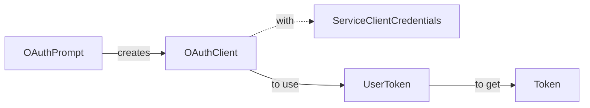

#### `AppCredentials` Class Diagram

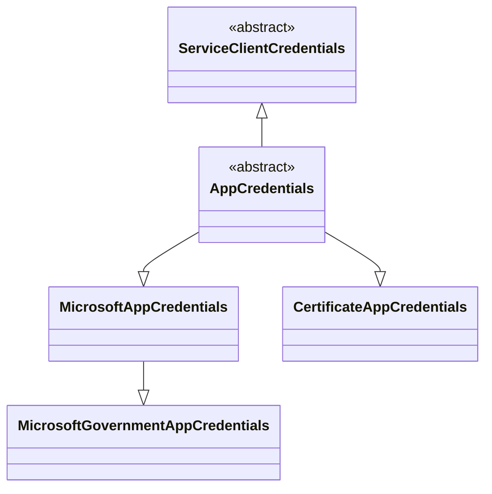
* `ServiceClientCredentials` is an [MS REST class](https://docs.microsoft.com/en-us/dotnet/api/microsoft.rest.serviceclientcredentials?view=azure-dotnet).

#### Participants Involved in Building `AppCredentials`

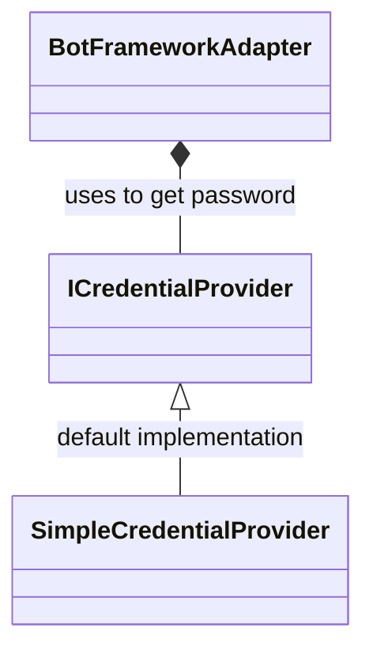

#### `BotFrameworkAdapter` Creates `OAuthClient`
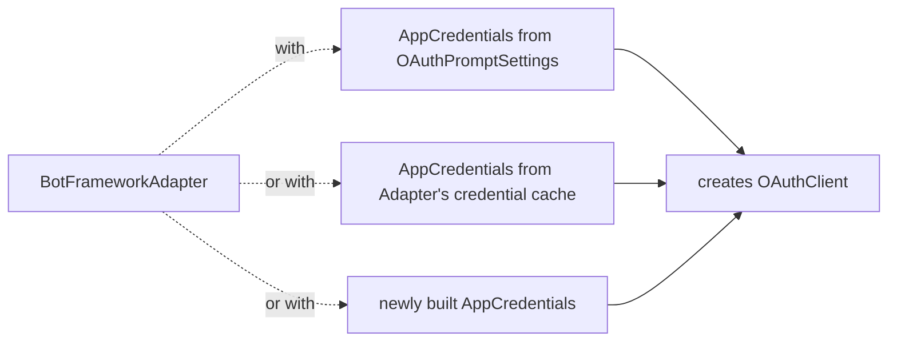

#### `OAuthClient` Class Diagram

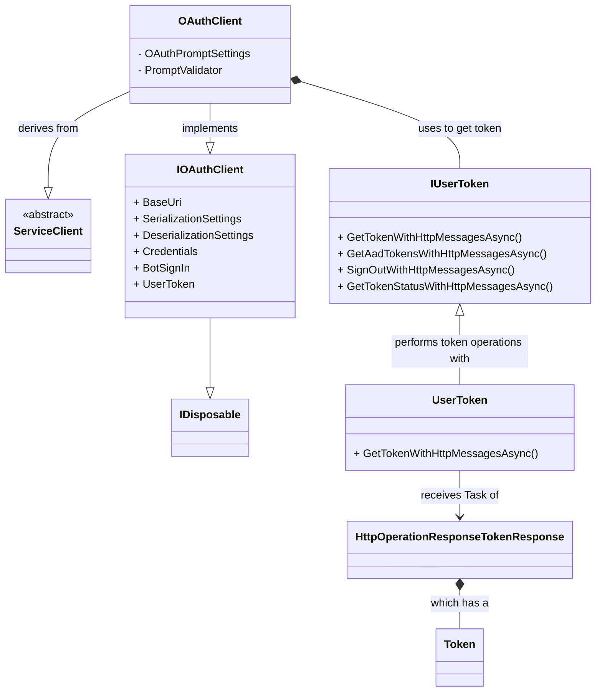
* `HttpOperationResponseTokenResponse` should be `HttpOperationResponse<TokenResponse>` (diagram tool breaks on special chars in class diagram).
* `ServiceClient` is an [MS REST class](https://docs.microsoft.com/en-us/dotnet/api/microsoft.rest.serviceclient-1?view=azure-dotnet).

#### **JS: Token Provider in `OAuthPrompt`:**

`OAuthPrompt` uses a `BotFrameworkAdapter` that implements `ExtendedUserTokenProvider` to acquire tokens.

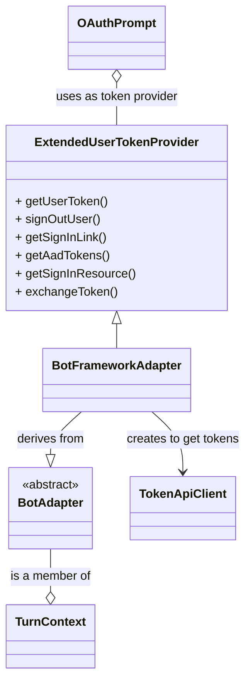

#### Use `AppCredentials` to create a `TokenApiClient`
- The `OAuthPrompt`'s `ExtendedUserTokenProvider` creates a `TokenApiClient` to send a request to get a token.
- You must use `ServiceClientCredentials` in order to initialize an `TokenApiClient` instance.

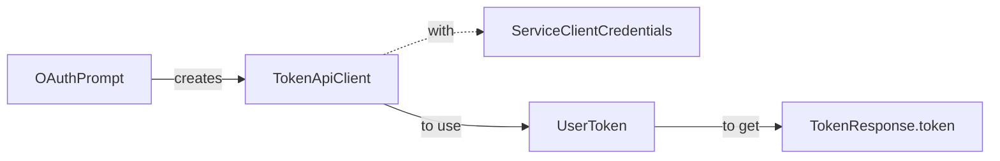

#### `AppCredentials` Class Diagram

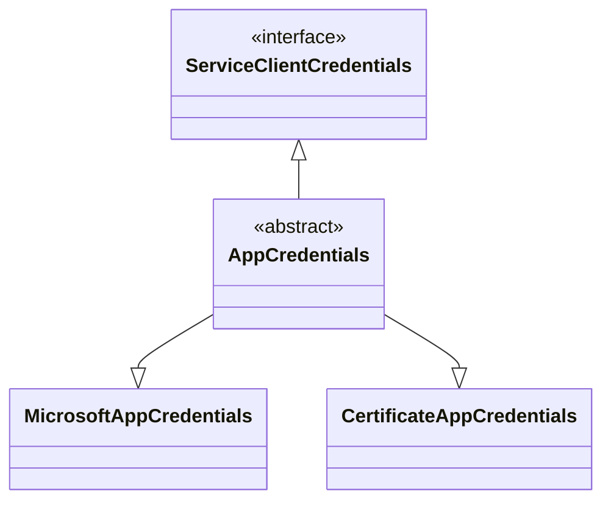
* `ServiceClientCredentials` is an [ms-rest interface](https://github.com/Azure/ms-rest-js/blob/master/lib/credentials/serviceClientCredentials.ts).

#### `TokenApiClient` Class Diagram
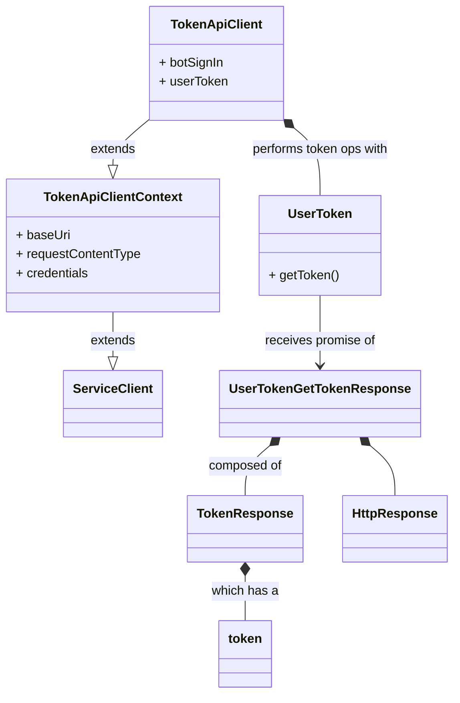

* `TokenApiClient` and `TokenApiClientContext` are classes generated by auto-rest.
* `ServiceClient` is an [msrest class](https://github.com/Azure/ms-rest-js/blob/master/lib/serviceClient.ts).