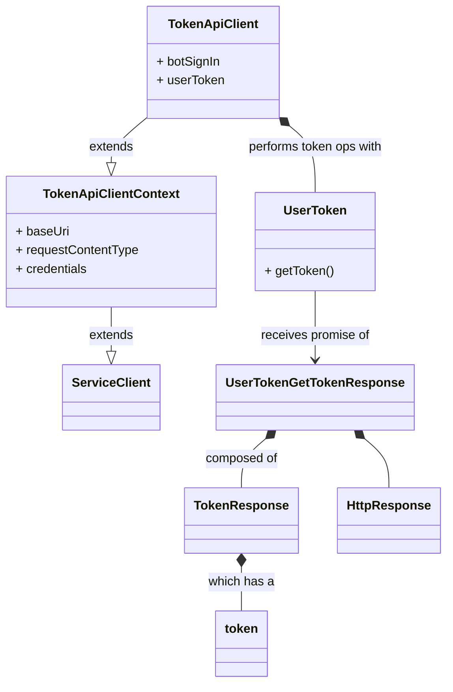

#### `TokenApiClient` Class Diagram

* `TokenApiClient` and `TokenApiClientContext` are classes generated by auto-rest.
* `ServiceClient` is an [msrest class](https://github.com/Azure/ms-rest-js/blob/master/lib/serviceClient.ts).