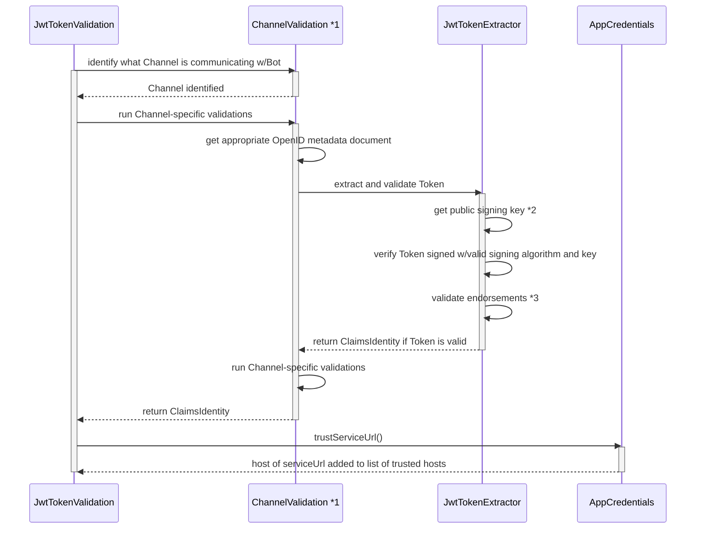

```mermaid
    sequenceDiagram
        participant JwtTokenValidation
        participant ChannelValidation as ChannelValidation *1
        participant JwtTokenExtractor
        participant AppCredentials
        
        JwtTokenValidation ->> ChannelValidation: identify what Channel is communicating w/Bot
        activate JwtTokenValidation
        activate ChannelValidation
            ChannelValidation -->> JwtTokenValidation: Channel identified
        deactivate ChannelValidation

        JwtTokenValidation ->> ChannelValidation: run Channel-specific validations
        activate ChannelValidation
            ChannelValidation ->> ChannelValidation: get appropriate OpenID metadata document
            ChannelValidation ->> JwtTokenExtractor: extract and validate Token
            activate JwtTokenExtractor
                JwtTokenExtractor ->> JwtTokenExtractor: get public signing key *2
                JwtTokenExtractor ->> JwtTokenExtractor: verify Token signed w/valid signing algorithm and key
                JwtTokenExtractor ->> JwtTokenExtractor: validate endorsements *3

                JwtTokenExtractor -->> ChannelValidation: return ClaimsIdentity if Token is valid
            deactivate JwtTokenExtractor
            ChannelValidation ->> ChannelValidation: run Channel-specific validations
            ChannelValidation -->> JwtTokenValidation: return ClaimsIdentity
        deactivate ChannelValidation

        JwtTokenValidation ->> AppCredentials: trustServiceUrl()
        activate AppCredentials
            AppCredentials -->> JwtTokenValidation: host of serviceUrl added to list of trusted hosts
        deactivate AppCredentials
        deactivate JwtTokenValidation

```