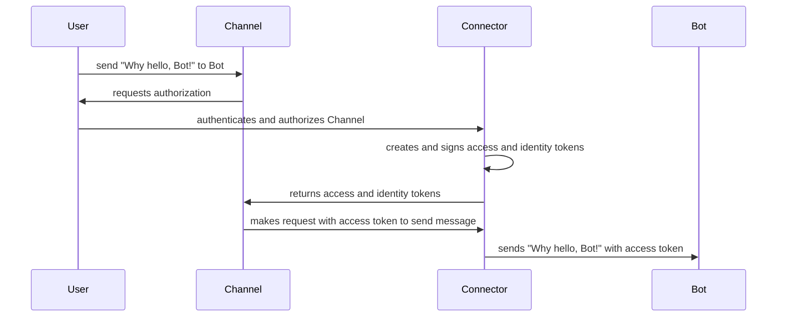

```mermaid
    sequenceDiagram
        participant User
        participant Channel
        participant Connector
        participant Bot

        User ->> Channel: send "Why hello, Bot!" to Bot
        Channel ->> User: requests authorization
        User ->> Connector: authenticates and authorizes Channel
        Connector ->> Connector: creates and signs access and identity tokens
        Connector ->> Channel: returns access and identity tokens
        Channel ->> Connector: makes request with access token to send message
        Connector ->> Bot: sends "Why hello, Bot!" with access token
```