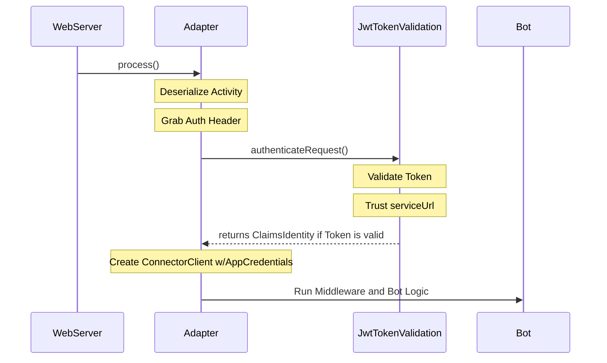

```mermaid
    sequenceDiagram
        participant WebServer
        participant Adapter
        participant JwtTokenValidation
        participant Bot

        WebServer ->> Adapter: process()
            Note over Adapter: Deserialize Activity
            Note over Adapter: Grab Auth Header

            Adapter ->> JwtTokenValidation: authenticateRequest()
                Note over JwtTokenValidation: Validate Token
                Note over JwtTokenValidation: Trust serviceUrl
            
                JwtTokenValidation -->> Adapter: returns ClaimsIdentity if Token is valid

            Note over Adapter: Create ConnectorClient w/AppCredentials

            Adapter ->> Bot: Run Middleware and Bot Logic
```