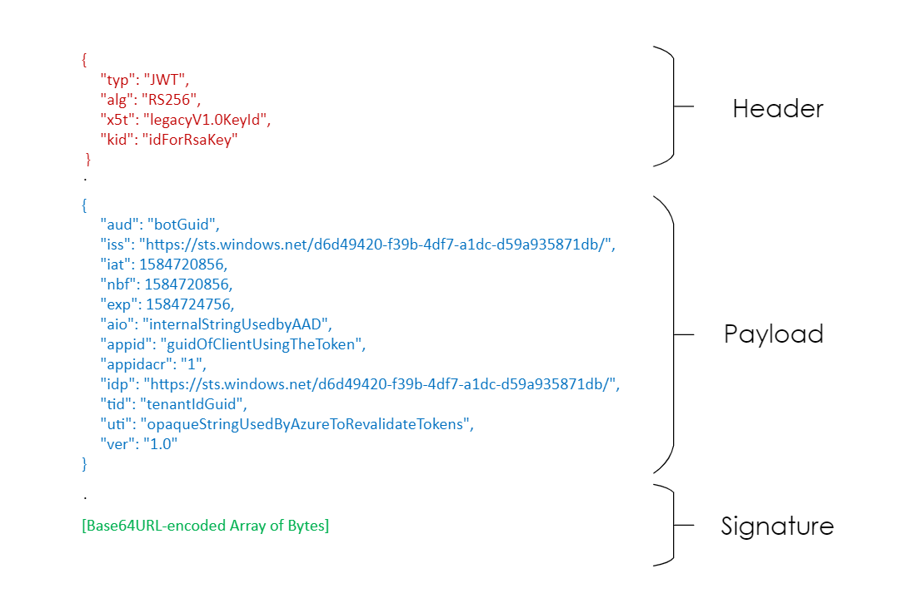
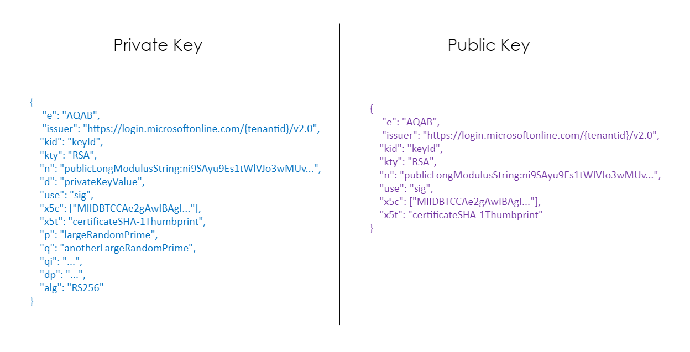

# Channel-to-Bot Authentication and Authorization

### *Prerequisite*
It is helpful to read the [Authentication](https://docs.microsoft.com/en-us/azure/bot-service/rest-api/bot-framework-rest-connector-authentication?view=azure-bot-service-3.0#connector-to-bot) documentation before reading this article. This Channel-to-Bot article expands further into the Bot Framework SDK layer details.

___

In order for Channels and Bots to communicate with each other securely, the framework implements OAuth 2.0 authorization flows with [OpenID Connect](https://openid.net/connect/) authentication. For a Channel to send activities to a Bot, the Bot must receive a Token, detailing that the Channel is *authorized* to send activities to the Bot.


When using the Bot Framework SDK and the default `BotFrameworkAdapter` (i.e. not a custom adapter), the Activity flow includes the Connector layer in between the Channel and Bot. The Connector is part of Azure Bot Service in the cloud, that allows Bots to exhange messages with multiple Channels configured through the Azure portal.



___

## **Scenario: User Sends a Message from Channel to Bot**

- [Overview of Channel to Bot Auth Flow](#overview-of-channel-to-bot-auth-flow)
- [Details on Signing in Auth Flows](#details-on-signing-in-auth-flows)
- [Verifying Tokens from Inbound Requests to Your Bot in the SDK](#verifying-tokens-from-inbound-requests-to-your-bot-in-the-sdk)

### **Overview of Channel to Bot Auth Flow**

*User at Channel sends message to Bot*


OAuth participants in this scenario:
- **Channel**: OAuth Client
- **Connector**: Authorization Server (AS) or Identity Provider (IdP)
- **Bot**: Protected Resource or the external service the client is trying to access

For more information on OAuth fundamentals regarding what exactly the components in OAuth flows are, see [Azure Active Directory V2 Protocols documentation](https://docs.microsoft.com/en-us/azure/active-directory/develop/active-directory-v2-protocols).

Depending on the request scenario, the User or the Channel itself first authenticates to the authorization endpoint of the Connector (`"/oauth2/v2.0/authorize"`), then authorizes the Channel to send messages to the Bot. To ensure the security of this authorization, the Connector, following [OpenID Connect](https://openid.net/connect/) standards, implements [JSON Object Signing and Encryption](https://www.iana.org/assignments/jose/jose.xhtml) (JOSE) specifications; after the Channel authenticates and authorizes at the Connector, the Connector creates an access token and an identity token, [asymmetrically signing](https://openid.net/specs/openid-connect-core-1_0.html#Signing) both. 

*Channel Acting on Behalf of Itself*


*Channel Acting on Behalf of User*


The Channel's request hits the Bot's `"api/messages"` endpoint, where the SDK verifies the validity of the Token (sent in the Authorization header of the request) before allowing the request to process with the Bot's business logic. 

___

### **Details on Signing in Auth Flows**
- [JWT Anatomy](#jwt-anatomy)
- [Signing Tokens](#signing-tokens)

#### **JWT Anatomy**
Tokens issued by the Bot Framework in auth flows are structured tokens conforming to [JSON Web Token](https://tools.ietf.org/html/rfc7519) (JWT) formatting. (Conversationally prounounced as "jot") . The anatomy of a JWT is: `header.payload.signature`, with the three parts separated by periods. Each value between the periods are Base64URL-encoded. 

*JWT Anatomy (Plaintext) - Example of a Token that a Bot Receives on an Inbound Request*



- **Header** - JSON Object used to describe information about the rest of the token and describes the cryptographic operations applied.
- **Payload** - JSON Object with a set of claims about the authorization.
- **Signature** - [JSON Web Signature (JWS)](https://tools.ietf.org/html/draft-jones-json-web-signature-04). Optional.

For definition on each of the claims, see [Microsoft identity platform access tokens](https://docs.microsoft.com/en-us/azure/active-directory/develop/access-tokens). Claims in token may vary in different auth flows.

In order to prevent the token from being maliciously manipulated, the Connector ensures to sign all tokens it issues.

#### **Signing Tokens**

*Participants Involved with the Token's Signature*



To armor tokens from attacks, the Connector [asymmetrically signs](https://openid.net/specs/openid-connect-core-1_0.html#Signing) tokens when it issues them. This essentially means that it uses a *private key* to sign the token, and then the Bot uses the Connector's *public key* to verify the token. To sign, the Connector needs to use a cryptographic algorithm and a key ([JWK](https://tools.ietf.org/html/rfc7517)). For example, using the [RS256](https://tools.ietf.org/html/rfc7518) signature method to sign a JWT with an [RSA key](https://simple.wikipedia.org/wiki/RSA_algorithm).



The Connector publishes [OpenID metadata documents](https://openid.net/specs/openid-connect-discovery-1_0.html#ProviderMetadata) that describes its token service's configuration. 

*OpenID Metadata Snippet*

```json
{
    "authorization_endpoint": "https://login.microsoftonline.com/common/oauth2/v2.0/authorize",
    "token_endpoint": "https://login.microsoftonline.com/common/oauth2/v2.0/token",
    "token_endpoint_auth_methods_supported": [
        "client_secret_post",
        "private_key_jwt",
        "client_secret_basic"
    ],
    "jwks_uri": "https://login.microsoftonline.com/common/discovery/v2.0/keys",
    "issuer": "https://login.microsoftonline.com/{tenantid}/v2.0",
    "id_token_signing_alg_values_supported": ["RS256"],
    "userinfo_endpoint": "https://graph.microsoft.com/oidc/userinfo"
    ...
}
```

- Included in this document, is the location of the public keys that the Connector uses to sign JWTs. The location is a well-known, static endpoint (`"https://login.microsoftonline.com/common/discovery/v2.0/keys"`). 
- See more information on OpenID metadata document in [Microsoft identity platform and OpenID Connect protocol](https://docs.microsoft.com/en-us/azure/active-directory/develop/v2-protocols-oidc#fetch-the-openid-connect-metadata-document).

Back in the JWT's header, it specifies the id of the key (`kid`)--as the Connector can publish multiple public keys--and the signing algorithm (`alg`) used to sign the token, which the Bot uses in its verification process of the signature.

___

### **Verifying Tokens from Inbound Requests to Your Bot in the SDK**

#### Higher Level View of Channel's Token Authentication in the Bot Framework SDK 
When a User at a Channel sends your Bot a message, the Bot Framework SDK validates the Token, to ensure the Channel's been authorized to communicate with the Bot first. 



The User's message sent from the Channel comes in as a request via the Bot's "`api/messages`" endpoint, where the request gets passed to the Adapter first. At the Adapter, the request is deserialized into an Activity object (a shape that your Bot understands how to consume), and the Channel's Token (sent via request's Authorization header) is checked with the SDK's `JwtTokenValidation`. Only if the Token is valid, will the Channel's request be allowed to reach the Bot's business logic.

#### Inbound Request's Token Authentication Details

`JwtTokenValidation.authenticateRequest()` houses the Bot Framework SDK's OAuth 2.0 and OpenID Connect flow patterns discussed in [Details on Signing in Auth Flows](#details-on-signing-in-auth-flow). First it identifies what Channel is trying to communicate with the Bot to then determine what is the appropriate OpenID metadata document to grab. Using the location specified in the medata document, the SDK will then proceed to get the public key counterpart to the private key that the Connector used to sign the Token. Subsequently, the SDK will ensure that the [Token's claims pass multiple checks](https://docs.microsoft.com/en-us/azure/bot-service/rest-api/bot-framework-rest-connector-authentication?view=azure-bot-service-3.0#step-4-verify-the-jwt-token) before saving the Token's content in the form of a `ClaimsIdentity`. After obtaining the identity, `authenticateRequest()` also adds the host of the Activity's `serviceUrl` to the list of trusted hosts.

*JwtTokenValidation Class Diagram - Participants in Token Validation*



*`authenticateRequest()` Sequence Diagram*
")
1. The `ChannelValidation` class in this auth flow depends on what Channel is communicating with the Bot. This class has Channel-specific validations. The appropriate validation class could be:
    - `ChannelValidation`
    - `EnterpriseChannelChannelValidation`
    - `EmulatorValidation`
    - `SkillValidation`
    - `GovernmentChannelValidation` (excluding C#)

2. Get Connector's public signing key from location specified in the OpenID metadata document.
3. Validate endorsements if key specifies that they are needed for the specific Channel that is communicating with Bot.
