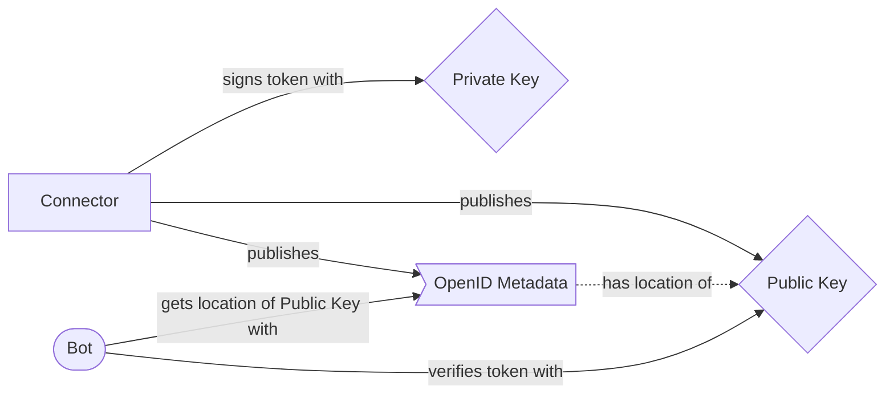

```mermaid
    graph LR

        Connector --signs token with --> Private{Private Key}

        Bot -- gets location of Public Key with --> Metadata>OpenID Metadata]
        Bot([Bot]) --verifies token with --> Public{Public Key}
        Metadata -. has location of .-> Public

        Connector -- publishes --> Public
        Connector -- publishes --> Metadata

```