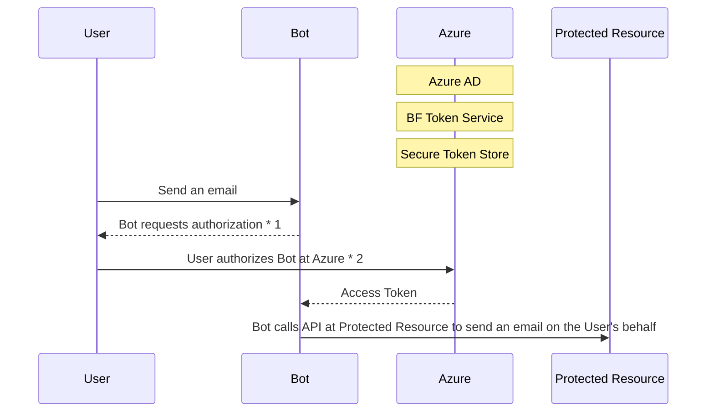

1. The Bot is asking for permission to access the Protected Resource (in this case, the User's email service) on the User's behalf
2. There are multiple types of OAuth flows that can take place here in order to authenticate the User (owner of the Protected Resource) and authorize the Bot (authorization code, client credentials, etc.). This high-level diagram excludes the various "OAuth dance" that could occur here.

3. **OAuth Participants**:
    - **User**: The User is the owner of the Protected Resource that the OAuth Client wants to access. User normally interacts via Channel or browser.
    - **OAuth Client**: In this example the Bot is what is known in OAuth as the *OAuth Client*. The OAuth Client is the party who acquires a Token to request access to a Protected Resource on behalf of the resource's owner
    - **Authorization Server**: The Authorization Server is responsible for validating that the User's identity as the owner of the Protected Resource, as well issuing Tokens to authorized parties (such as to the OAuth Client). The Authorization Server is trusted by the Protected Resource--as in, the Protected Resource trusts Tokens issued by a specific Authorization Server
    - **Protected Resource**: The external service that the OAuth Client wants to access on behalf of the owner. (i.e. the *resource* that we want to access)
    