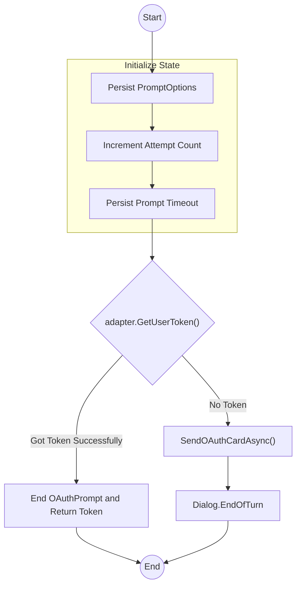

# `OAuthPrompt.BeginDialogAsync()` Flow

```mermaid
    graph TD
        Start((Start)) --> PromptOptions
        
        subgraph Initialize State
            PromptOptions[Persist PromptOptions] --> AttemptCount[Increment Attempt Count]
            AttemptCount --> Timeout[Persist Prompt Timeout]
        end
        
        Timeout --> GetUserToken{"adapter.GetUserToken()"}
        GetUserToken -- Got Token Successfully--> ReturnToken[End OAuthPrompt and Return Token]
        GetUserToken -- No Token --> SendOAuthCard["SendOAuthCardAsync()"]
        SendOAuthCard --> EndOfTurn[Dialog.EndOfTurn]

        ReturnToken --> End((End))
        EndOfTurn --> End((End))
```