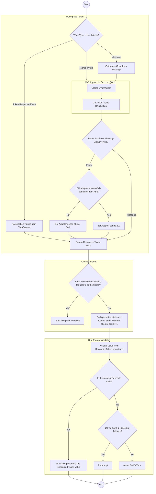

## Detailed View

```mermaid
    graph TD
        Start((Start)) --> ResponseType{What Type is the Activity?}
        subgraph Recognize Token
            ResponseType -- Token Response Event --> TokenResponseActivity[Parse token values from TurnContext]
            
            ResponseType -- Teams Invoke --> CreateOAuthClient[Create OAuthClient]

            ResponseType -- Message --> MagicCode[Get Magic Code from Message]
            MagicCode --> CreateOAuthClient
            
            subgraph Use Adapter to Get User Token
                CreateOAuthClient --> GetUserTokenAsync[Get Token using OAuthClient]
            end

            GetUserTokenAsync --> TeamsOrMessage{Teams Invoke or Message Activity Type?}

            TeamsOrMessage -- Teams --> TeamsGotTokenCheck{Did adapter successfully get token from ABS?}
            TeamsGotTokenCheck -- No --> TeamsError[Bot Adapter sends 404 or 500]
            TeamsGotTokenCheck -- Yes --> TeamsSuccess[Bot Adapter sends 200]

            TeamsOrMessage -- Message --> ReturnRecognizeTokenResult[Return Recognize Token result]
            TokenResponseActivity --> ReturnRecognizeTokenResult
            TeamsError --> ReturnRecognizeTokenResult
            TeamsSuccess --> ReturnRecognizeTokenResult
        end

        ReturnRecognizeTokenResult --> Timeout{Have we timed out waiting for user to authenticate?}
        subgraph Check Timeout
            Timeout -- Yes --> EndDialogNoResult[EndDialog with no result]
            Timeout -- No --> State[Grab persisted state and options, and increment attempt count +1]
        end

        subgraph Run Prompt Validator
            State --> Validate[Validate value from RecognizeToken operations]
            Validate --> IsValid{Is the recognized result valid?}
            
            IsValid -- Yes --> EndDialogReturningValue[EndDialog returning the recognized Token value]
            IsValid -- No --> HasReprompt{Do we have a Reprompt fallback?}

            HasReprompt -- Yes --> Reprompt
            HasReprompt -- No --> EndOfTurn[return EndOfTurn]
        end
        EndDialogReturningValue --> End((End))
        Reprompt --> End((End))
        EndOfTurn --> End((End))
```