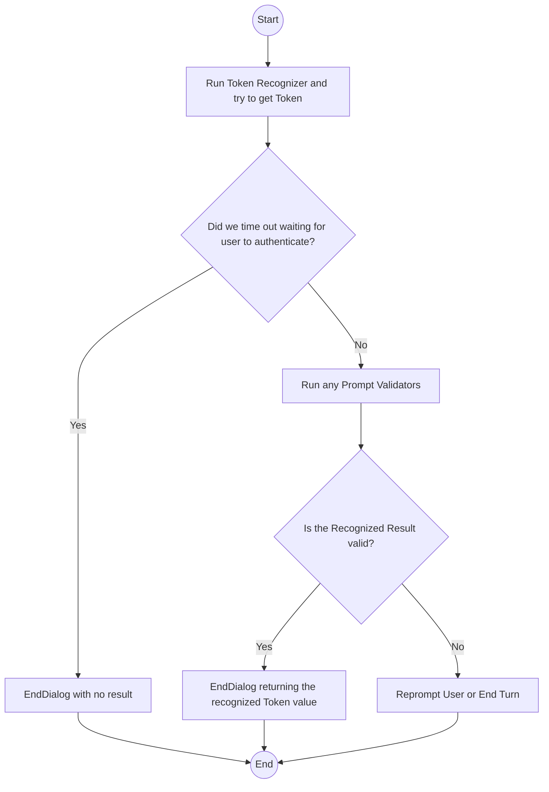

# `OAuthPrompt.ContinueDialogAsync()` Flow

## Higher Level

```mermaid
    graph TD
    Start((Start)) --> RecognizeToken[Run Token Recognizer and try to get Token]
    RecognizeToken --> Timeout{Did we time out waiting for user to authenticate?}
    Timeout -- Yes --> EndDialogNoResult[EndDialog with no result]
    Timeout -- No --> Validator[Run any Prompt Validators]
    Validator --> IsValid{Is the Recognized Result valid?}
    IsValid -- Yes --> EndDialogReturningValue[EndDialog returning the recognized Token value]
    IsValid -- No --> RepromptOrEndTurn[Reprompt User or End Turn]

    EndDialogNoResult --> End((End))
    EndDialogReturningValue --> End((End))
    RepromptOrEndTurn --> End((End))
```