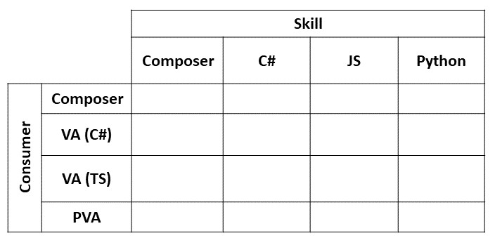

# Skill sends a proactive message to consumer

> A consumer calls a _timer skill_ and the skill finishes the conversation but stores some tasks. Then, some time later the skill sends an update to the consumer as a message.

## Variations

1. The skill starts a multiturn dialog.
   - When the timer is up the skill sends an option to snooze or end. 
  
## Testing matrix

- Skill: [Proactive skill](../SkillsFunctionalTesting.md#proactive-skill)
- Topology: [Simple](../SkillsFunctionalTesting.md#simple)

## Variables

- Auth context: Public Cloud, Gov Cloud, Sandboxed
- Delivery mode: Normal, ExpectReplies

## Total test cases

96 (not including variations)
