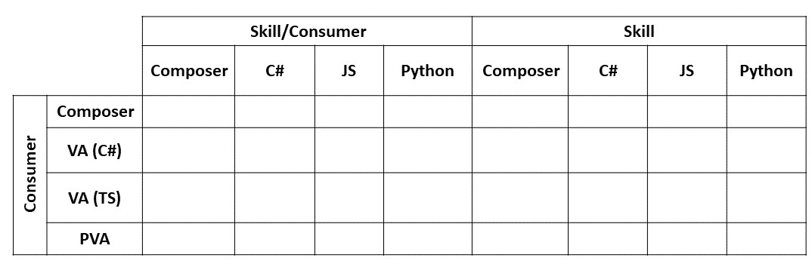

# Skill calls another skill

> TODO

## Variations

- Proactively initiate a multi turn conversation.

## Testing matrix

- Skill/Consumer: TBD
- Skill: TBD
- Topology: [Skill chaining](../SkillsFunctionalTesting.md#skill-chaining)

## Variables

- Auth context: Public Cloud, Gov Cloud, Sandboxed
- Delivery mode: Normal, ExpectReplies

## Total test cases

192 (not including variations)
